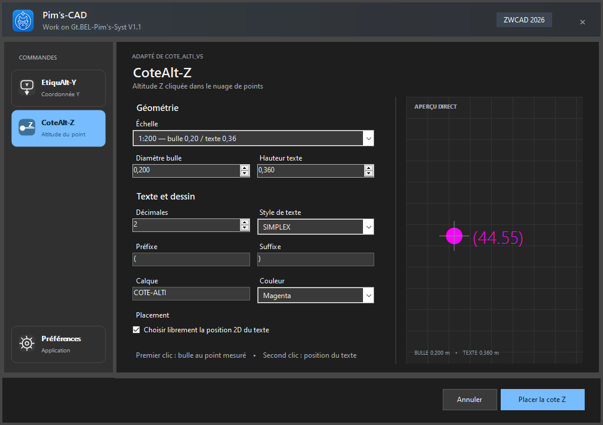

  

<h1 align="center">Pim's-CAD — Centre de téléchargement</h1>

  Extensions d'annotation, de carroyage, de talus et de prise de notes pour ZWCAD 2026 sous Windows 11.

  <a href="https://github.com/D6BEL9835/Pims-CAD-Updates/releases/tag/BETA1.3.0"><strong>Voir les téléchargements BETA1.3.0</strong></a>

## Accès sous licence

Pim's-CAD est un logiciel privé réservé aux utilisateurs autorisés. L'installateur peut être téléchargé depuis cette page, mais les commandes restent verrouillées sans fichier de licence `.pimlic` valide, signé et associé à l'ordinateur concerné.

Au premier lancement, transmettez l'identifiant affiché à votre administrateur Pim's-CAD, puis importez le fichier de licence reçu.

  

## Fonctions

### Annotation et NUMBULLE

La fenêtre Annotation regroupe Cote ALT Z, EtiquAlt-Y et NUMBULLE. NUMBULLE place des numéros de lot en suite automatique, avec cercle simple ou double et adaptation aux valeurs de trois et quatre chiffres.

### EtiquAlt-Y

Étiquette dynamique de coordonnée Y avec bulle, flèche et poignées d'édition.

  

### CoteAlt-Z

Mesure de l'altitude au premier clic, puis placement libre du texte avec aperçu direct.

  

### Carroyage

Création d'un carroyage 2D dynamique depuis deux coins ou une polyligne fermée, avec orientation du SCU, repères, coordonnées X/Y intérieures, calques, couleurs et échelles prédéfinies, dont 1:125.

  

### Talus

Création automatique des barbules entre une limite haute et une limite de pied, avec motifs régulier, alterné long/court et progressif, ainsi que les réglages d'échelle, d'espacement, de calque et de couleur.

  

### Notes & Calculs

Notes locales, copie facultative dans le DWG, export `.TXT` et calculatrice intégrée.

  

## Installation

1. Fermez complètement ZWCAD.
2. Téléchargez `Pims-CAD-BETA1.3.0-Setup.exe` depuis les versions publiées.
3. Lancez l'installateur et choisissez le dossier souhaité.
4. Relancez ZWCAD, puis activez Pim's-CAD avec le fichier reçu de votre administrateur.

Compatible avec **Windows 11 64 bits** et **ZWCAD 2026 64 bits**.

L'installation utilise désormais un dossier stable et supprime automatiquement les anciens bundles, désinstalleurs et enregistrements Pim's-CAD. Une seule version reste visible dans ZWCAD et dans les applications Windows ; les licences, notes et préférences sont conservées.

> L'installateur BETA1.3.0 n'est pas encore signé numériquement. Windows SmartScreen peut demander une confirmation lors du premier lancement.

## Confidentialité

Ce dépôt contient uniquement les téléchargements, les illustrations et les informations de mise à jour. Le code source et les outils de génération de licences ne sont pas publics.

