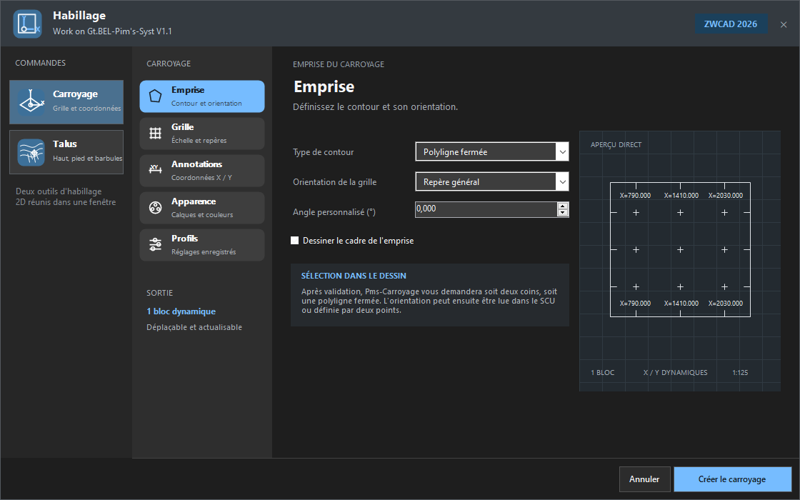
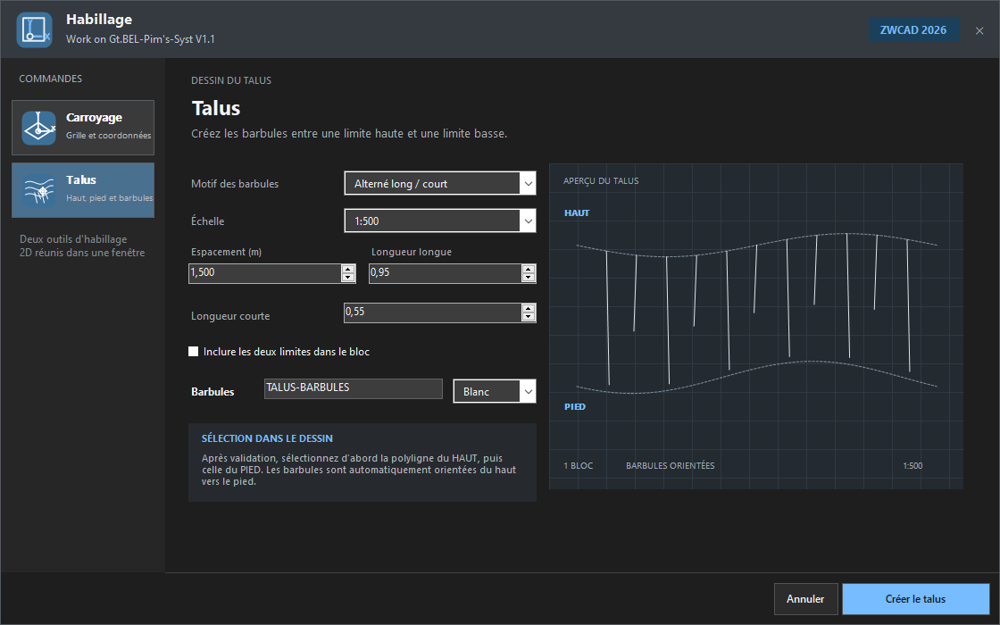

# Pim's-CAD BETA1.2.0

BETA1.2.0 introduit la fenêtre **Habillage**, deux nouvelles commandes de dessin 2D et un parcours de mise à jour plus visible. Cette version remplace automatiquement les anciennes installations Pim's-CAD afin d'éviter les doublons dans ZWCAD et dans les applications Windows.

## Nouveautés

### Habillage et Carroyage

- nouvelle fenêtre `PMSHABILLAGE` regroupant les outils d'habillage 2D ;
- nouvelle commande `PMSCARROYAGE` pour créer un carroyage depuis deux coins ou une polyligne fermée ;
- orientation selon le SCU général, le SCU courant ou deux points ;
- grille, repères et coordonnées X/Y dynamiques dans un bloc unique ;
- réglage des côtés annotés, des calques, des couleurs et des profils ;
- échelles prédéfinies 1:100, 1:125, 1:150, 1:200, 1:500 et 1:1000.

### Talus

- nouvelle commande `PMSTALUS` dans la fenêtre Habillage ;
- sélection d'une polyligne haute puis d'une polyligne de pied ;
- création automatique des barbules orientées du haut vers le pied ;
- motifs régulier, alterné long/court et progressif ;
- réglage de l'échelle, de l'espacement, des longueurs, du calque et de la couleur ;
- sortie dans un bloc unique, déplaçable avec le dessin.

### Mises à jour

- notification en bas à droite lorsqu'une nouvelle version est trouvée ;
- pastille rouge sur le bouton Pims-CAD du ruban ;
- pastille rouge sur la page Préférences ;
- commande de simulation `PMSMAJTEST`, sans téléchargement ni modification des réglages réels ;
- vérification de l'adresse GitHub, de la taille et de l'empreinte SHA-256 avant l'ouverture d'un installateur téléchargé.

## Corrections et améliorations

- correction du positionnement d'un carroyage rectangulaire dans un SCU ou une vue tournée ;
- coordonnées toujours placées à l'intérieur du cadre avec une marge proportionnelle à l'échelle ;
- préfixes compacts `X=` et `Y=` et meilleure disposition sur les quatre côtés ;
- chargement différé du module Habillage afin d'éviter une erreur au démarrage de `PmsCarroyage.dll` ;
- logo Habillage harmonisé entre le ruban et la fenêtre ;
- aperçu Talus agrandi et espace de la fenêtre mieux réparti.

## Mise à niveau sans doublon

- installation dans `%LOCALAPPDATA%\Pim's-CAD\Application` ;
- suppression automatique des anciens bundles et désinstalleurs BETA ;
- suppression des anciennes entrées Pim's-CAD dans ZWCAD et dans les applications Windows ;
- conservation des licences, notes et préférences stockées dans le profil utilisateur ;
- test automatique du remplacement des anciennes versions pendant la construction de l'installateur.

## Installation

1. Enregistrez vos dessins et fermez complètement ZWCAD.
2. Lancez `Pims-CAD-BETA1.2.0-Setup.exe`.
3. Cliquez sur **Installer** : les anciennes versions Pim's-CAD sont remplacées automatiquement.
4. Relancez ZWCAD 2026.

Compatible avec **Windows 11 64 bits** et **ZWCAD 2026 64 bits**.

## Contrôle de l'installateur

- taille : `9 298 432` octets ;
- SHA-256 : `bc70b00733730541b3567e9cfeaef684b2f596c71c05e1e490b7383da56b6acb`.

> L'installateur n'est pas encore signé numériquement. Windows SmartScreen peut demander une confirmation lors du premier lancement.
